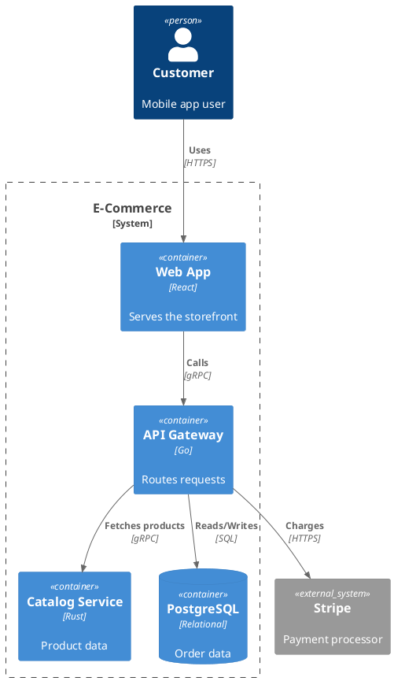
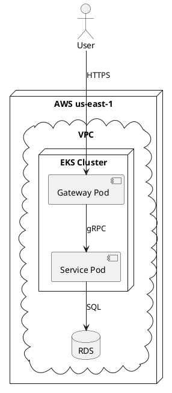
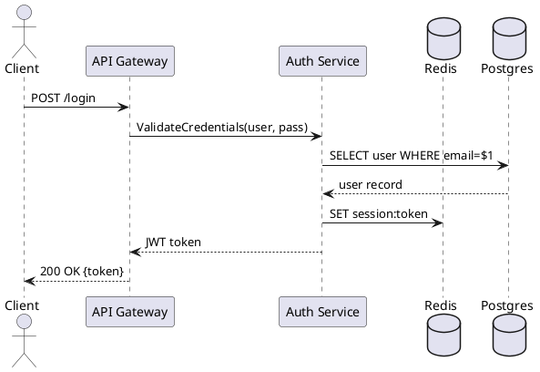
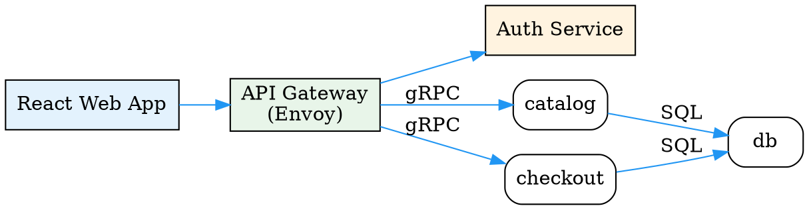

# Diagram Generation via Kroki

Generates diagrams by writing diagram source code → calling the `kroki` MCP server → saving the SVG/PNG result to disk. The MCP tool `generate_diagram` returns visual output directly; save it to a file with a descriptive name.

## Quick Start

1. Identify the right diagram **type** (see guide below)
2. Write the diagram **source code** in that syntax
3. Call the MCP tool:
   ```
   kroki: generate_diagram(diagramType, source, format="svg")
   ```
4. Save the returned SVG/PNG to disk with a `.svg` or `.png` extension

## Diagram Type Selection Guide

| Scenario | Use `diagramType` | Why |
|----------|------------------|-----|
| System architecture (context/container/component) | `c4plantuml` | Purpose-built for C4 model |
| Deployment topologies, network diagrams | `plantuml` | Best node/edge layout |
| Sequence/interaction flows | `plantuml` or `mermaid` | Both excel here |
| Data pipelines, ETL flows | `mermaid` | Clean linear flow layout |
| Database schemas, ER diagrams | `mermaid` or `erd` | ER-specific shapes |
| Class/hierarchy diagrams | `plantuml` | Full UML class support |
| Network topology, dependency graphs | `graphviz` | Radially-tuned layouts |
| Infrastructure diagrams (rack/network) | `nwdiag` or `rackdiag` | Domain-specific shapes |
| Business process models | `bpmn` | BPMN 2.0 standard |
| Quick block diagrams | `d2` | Cleanest modern syntax |
| State machines | `plantuml` or `mermaid` | Both have state support |

## Syntax Cheat Sheets

### C4-PlantUML (`c4plantuml`) — Architecture Models



### PlantUML (`plantuml`) — Deployment & Sequence

**Deployment diagram:**


**Sequence diagram:**


### Mermaid (`mermaid`) — Flowcharts & ER

**Flowchart:**
````
flowchart TD
    A[User Request] --> B{Authenticated?}
    B -->|Yes| C[Authorize]
    B -->|No| D[Return 401]
    C --> E{Permission OK?}
    E -->|Yes| F[Process Request]
    E -->|No| G[Return 403]
    F --> H[Return Result]
````

**ER diagram:**
````
erDiagram
    CUSTOMER ||--o{ ORDER : places
    ORDER ||--|{ LINE-ITEM : contains
    PRODUCT ||--o{ LINE-ITEM : "ordered in"
    CUSTOMER {
        string id PK
        string email
        string name
    }
    ORDER {
        string id PK
        string customer_id FK
        date created_at
        string status
    }
````

### D2 (`d2`) — Modern Block Diagrams

```
direction: right
server: API Server {
  shape: rectangle
  style.fill: "#E3F2FD"
}
database: PostgreSQL {
  shape: cylinder
  style.fill: "#FFF3E0"
}
server -> database: SQL queries {
  style.stroke: "#4CAF50"
}
cache: Redis {
  shape: hexagon
  style.fill: "#FFEBEE"
}
server -> cache: GET/SET {
  style.stroke: "#F44336"
}
```

### GraphViz (`graphviz`) — Network & Dependency



## Output & Naming Conventions

- Default to `format="svg"` for infinite scalability (all diagram types)
- Use `format="png"` only for `plantuml` and `c4plantuml` types (other types do not support raster output via Kroki)
- `format="pdf"` available for `plantuml` and `c4plantuml` only
- JPEG is **not supported** by Kroki at all — do not request it
- Name files descriptively: `<system>-<view>-<diagram-type>.svg`
  - `ecommerce-container-diagram.svg`
  - `auth-sequence-flow.svg`
  - `microservices-deployment.svg`
- Save to a dedicated directory (default: `./diagrams/`), create if missing

## Error Recovery

1. **Syntax error from Kroki** → Check the diagram type enum matches (`c4plantuml` not `c4-plantuml`)
2. **Rendering looks wrong** → Verify quotes around labels with special chars; use single-line labels
3. **Returned data is empty** → Ensure `source` is not empty; Kroki may 4xx on bad input

## MCP Tool Reference

Three tools available on the `kroki` MCP server:

- `generate_diagram(diagramType, source, format)` → Returns SVG/PNG image data — **use this by default**
- `generate_png_diagram_with_custom_dpi(diagramType, source, dpi)` → High-DPI PNG
- `get_diagram_url(diagramType, source, format)` → Returns a Kroki URL for sharing
