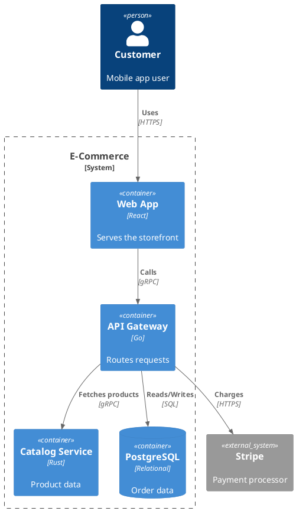
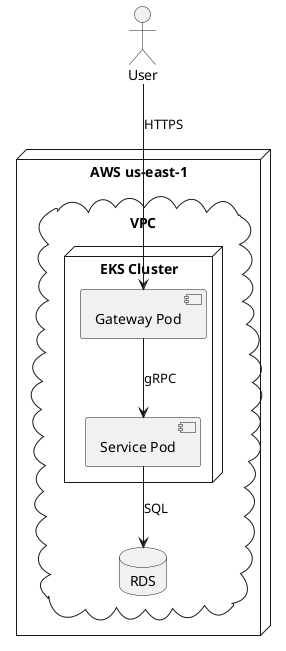
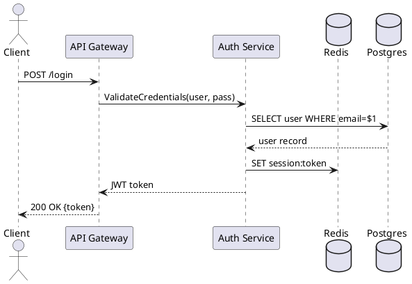

| State machines | `plantuml` or `mermaid` | Both have state support |

## Syntax Cheat Sheets

### C4-PlantUML (`c4plantuml`) — Architecture Models



### PlantUML (`plantuml`) — Deployment & Sequence

**Deployment diagram:**


**Sequence diagram:**


### Mermaid (`mermaid`) — Flowcharts & ER

**Flowchart:**
````
flowchart TD
    A[User Request] --> B{Authenticated?}
    B -->|Yes| C[Authorize]
    B -->|No| D[Return 401]
    C --> E{Permission OK?}
    E -->|Yes| F[Process Request]
    E -->|No| G[Return 403]
    F --> H[Return Result]
````

**ER diagram:**
````
erDiagram
    CUSTOMER ||--o{ ORDER : places
    ORDER ||--|{ LINE-ITEM : contains
    PRODUCT ||--o{ LINE-ITEM : "ordered in"
    CUSTOMER {
        string id PK
        string email
        string name
    }
    ORDER {
        string id PK
        string customer_id FK
        date created_at
        string status
    }
````

### D2 (`d2`) — Modern Block Diagrams

```
direction: right
server: API Server {
  shape: rectangle
  style.fill: "#E3F2FD"
}
database: PostgreSQL {
  shape: cylinder
  style.fill: "#FFF3E0"
}
server -> database: SQL queries {
  style.stroke: "#4CAF50"
}
cache: Redis {
  shape: hexagon
  style.fill: "#FFEBEE"
}
server -> cache: GET/SET {
  style.stroke: "#F44336"
}
```

### GraphViz (`graphviz`) — Network & Dependency

```dot
digraph G {
    rankdir=LR;
    node [shape=box, style=rounded];

    edge [color="#2196F3"];

    frontend [label="React Web App", fillcolor="#E3F2FD", style="filled"];
    gateway [label="API Gateway\n(Envoy)", fillcolor="#E8F5E9", style="filled"];
    auth [label="Auth Service", fillcolor="#FFF3E0", style="filled"];

    frontend -> gateway;
    gateway -> auth;
    gateway -> catalog [label="gRPC"];
    gateway -> checkout [label="gRPC"];
    catalog -> db [label="SQL"];
    checkout -> db [label="SQL"];
